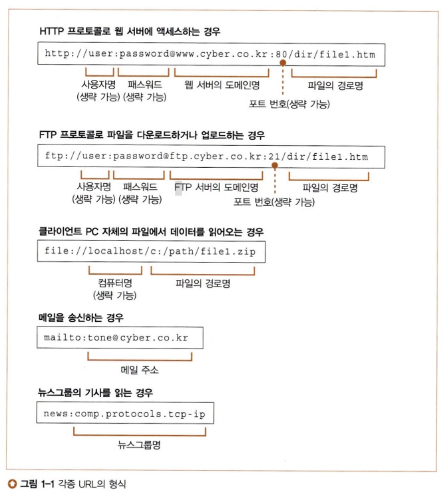
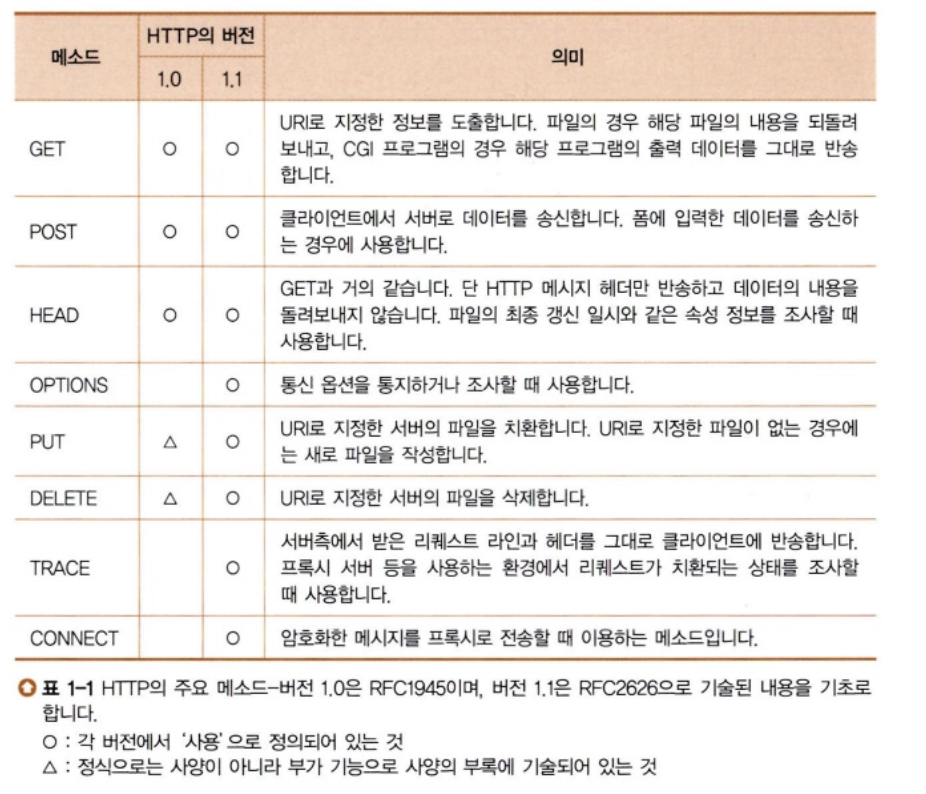

## 1. 웹 브라우저가 메시지를 만든다

### 1-1 HTTP 리퀘스트 메시지를 작성한다
탐험 여행은 URL 입력부터 시작한다
- URL은 여러 가지가 있다
- 브라우저는 웹 서버에 액세스하는 클라이언트 외에도 파일을 다운로드/업로드하는 FTP의 클라이언트 기능, 메일의 클라이언트 기능도 가지고 있다
- 브라우저는 복합적인 클라이언트 소프트웨어
- url의 공통점: url의 맨 앞에 있는 문자열은 엑세스 하는 방법을 나타낸다

브라우저는 먼저 URL을 해독한다
- 브라우저는 웹 서버에 보내는 리퀘스트 메시지를 작성하기 위해 URL을 해독한다
- http://www.lab.cyber.co.kr/dir1/file1.html
    - 데이터의 출처에 액세스 하는 방법(프로토콜): http:
    - 나중에 이어지는 문자열이 서버명임을 나타냄: //
    - 웹 서버의 이름: www.lab.cyber.co.kr
    - 파일 경로명: /dir1/file1.html

파일명을 생략한 경우
- http://www.lab.cyber.co.kr/dir
- 파일명을 쓰지 않으면 어느 파일에 액세스 해야 할 지 모르기 때문에 파일명을 미리 서버측에 설치해 둔다
- 대부분의 서버는 index.html, default.html라는 기본 파일명을 설정해둔다. 
- 웹 서버의 도메인명만 쓴 URL도 파일명을 생략한 것(http://www.lab.cyber.co.kr/)
- 루트 디렉토리까지 쓰지 않을 때: 루트 디렉토리 아래에 있는 미리 설정된 파일명의 파일로 자동으로 이동된다.

HTTP의 기본 개념
- URL을 해독하면 어디에 액세스해야하는지 판명
- 그 이후 HTTP 프로토콜을 사용하여 웹 서버에 엑세스
- HTTP 프로토콜
    - 클라이언트와 서버가 주고받은 메시지의 내용이나 순서를 정한 것
    - 클라인언트에서 먼저 서버를 향해 리퀘스트 메세지를 보낸다
    - 리퀘스트 메세지 안에는 '무엇을','어떻게 해서' 하겠다는 내용이 들어 있음
    - URI: '무엇을'에 해당하는 것
    - 메소드: '어떻게 해서'에 해당하는 것
        - 메소드에 의해 웹 서버에 어떤 동작을 하고 싶은지 전달
        - 
    - 리퀘스트 메시지가 웹 서버에 도착하면 웹 서버는 그 속에 쓰여있는 내용 해독
    - URL과 메시지를 조사하여 요구에 따라 동작
    - 결과 데이터를 응답 메시지에 저장
    - 응답 메시지의 맨 앞부분에는 실행 결과가 정상 종료되었는지, 이상이 발생했는지 나타내는 스테이터스 코드가 있음

- 메소드의 종류
    - GET: 웹 서버에 액세스하여 페이지의 데이터를 읽을 때 사용
        - 메소드에는 GET
        - URI에는 페이지의 데이터를 저장한 파일의 이름을 씀
        - 웹 서버에 도착하면 서버는 파일을 열고 내용의 데이터를 추출
        - 추출한 데이터를 응답 데이터에 포함해서 클라이언트에 반송
    - POST: 폼에 데이터를 사용해서 웹 서버에 송신하는 경우에 사용
        - URI에는 웹 서버 기계에서 동작하는 애플리케이션 프로그램의 파일명을 적음(index.cgi, index.php)
        - 리퀘스트 메시지 안에는 메시지, URI, 사용자가 필드에 입력한 값을 씀
        - 메시지가 서버 기계에 도착하면 웹 서버 소프트웨어는 URI에 저장된 프로그램에게 리퀘스트 메세지 안에 쓰여있는 데이터를 건네줌
        - 이 프로그램이 출력하는 데이터를 받아 응답 메시지에 포함시킨 후 클라이언트에 반송

HTTP 리퀘스트 메시지를 만든다
- HTTP 메시지의 포맷에 맞게 리퀘스트 메시지를 제작
- 리퀘스트 라인
    - 맨 앞에 메소드 작성
    - 브라우저의 동작 상태에 있음
    - URL을 입력하면 GET 메소드, 하이퍼링크를 클릭한 경우에도 GET 메소드, 폼의 경우에는 리퀘스트를 각자 지정한 후 GET, POST를 구분하여 사용
- 메시지 헤더
    - 리퀘스트의 상세한 내용 설명
    - 공백 행을 넣고, 송신할 데이터를 쓴다(메시지 본문)
    - 메소드가 GET이면 메시지 본문에 쓰는 송신 데이터는 없음
    - 메소드가 POST이면 폼에 입력한 데이터를 메시지 본문에 작성

리쿼스트 메시지를 보내면 응답이 되돌아온다
- 스테이터스 코드: 숫자로 쓴 것, 프로그램 등에 실행 결과를 알려주는 것이 목적
- 응답 문구: 문장으로 쓰여 있으며 사람에게 실행결과를 알리는 것이 목적
- 영상 등으로 포함한 경우에는 태그 라는 제어 정보 포함
    - 브라우저는 태그를 탐색
    - 태그를 만나면 영상용 공백을 비워두고 문장을 표시
    - 이후 웹 서버에 액세스하여 태그에 쓰여있는 영상 파일을 웹 서버에서 읽어와서 방금 전에 비워둔 공백에 표시
- 리쿼스트 메시지에 쓰는 URI는 한 개만으로 결정
- 파일을 한 번에 한 개씩만 읽을 수 있기 때문에 파일을 따로 읽어야 한다
- 한 문장에 3개의 영상이 포함되어 있다면 총 4회 리퀘스트 메시지를 웹 서버에 보냄

### 1-2 웹 서버의 IP 주소를 DNS 서버에 조회한다
IP 주소의 기본

도메인명과 IP주소를 구분하여 사용하는 이유

Socket 라이브러리가 IP주소를 찾는 기능을 제공한다

리졸버를 이용하여 DNS 서버를 조회한다

리졸버 내부의 작동

### 1-3 전 세계의 DNS 서버가 연대한다
1. DNS 서버의 기본 동작

2. 도메인의 계층

3. 담당 DNS 서버를 찾아 IP 주소를 가져온다

4. DNS 서버는 캐시 기능으로 빠르게 회답할 수 있다

### 1-4 프로토콜 스택에 메세지 송신을 의뢰한다
