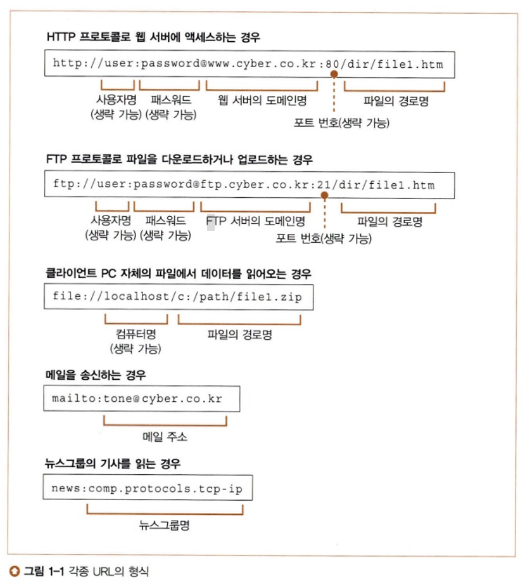
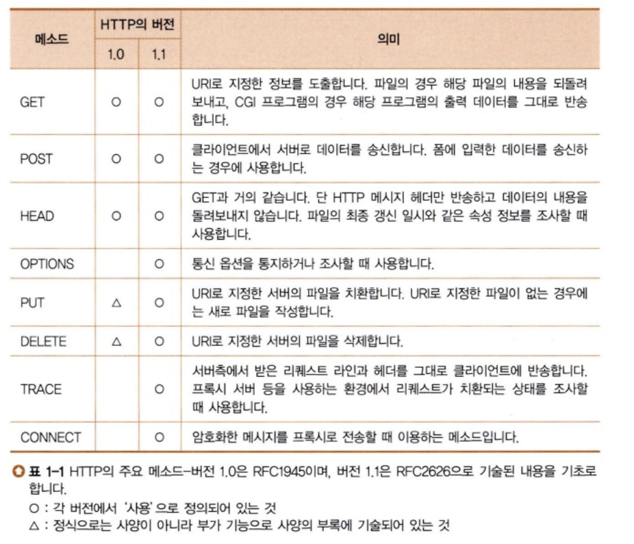
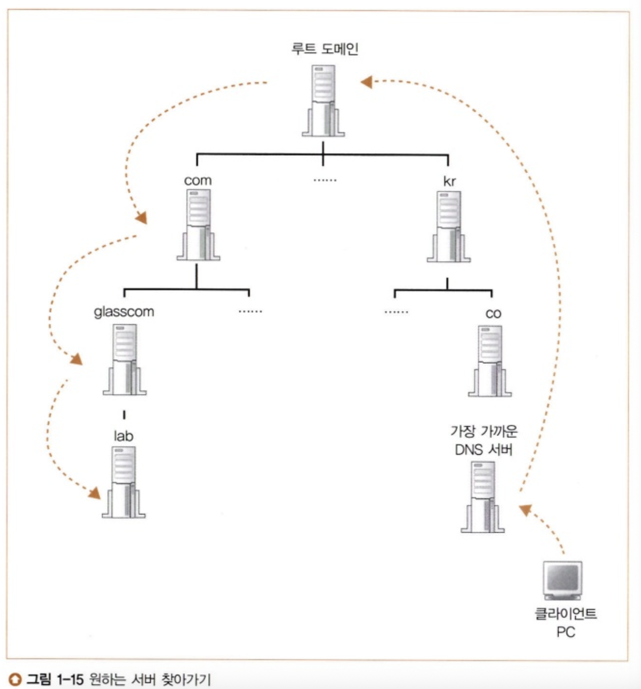

## 1. 웹 브라우저가 메시지를 만든다

### 1-1 HTTP 리퀘스트 메시지를 작성한다
1. 탐험 여행은 URL 입력부터 시작한다
- URL은 여러 가지가 있다
- 브라우저는 웹 서버에 액세스하는 클라이언트 외에도 파일을 다운로드/업로드하는 FTP의 클라이언트 기능, 메일의 클라이언트 기능도 가지고 있다
- 브라우저는 복합적인 클라이언트 소프트웨어
- url의 공통점: url의 맨 앞에 있는 문자열은 엑세스 하는 방법을 나타낸다

2. 브라우저는 먼저 URL을 해독한다
- 브라우저는 웹 서버에 보내는 리퀘스트 메시지를 작성하기 위해 URL을 해독한다
- http://www.lab.cyber.co.kr/dir1/file1.html
    - 데이터의 출처에 액세스 하는 방법(프로토콜): http:
    - 나중에 이어지는 문자열이 서버명임을 나타냄: //
    - 웹 서버의 이름: www.lab.cyber.co.kr
    - 파일 경로명: /dir1/file1.html

3. 파일명을 생략한 경우
- http://www.lab.cyber.co.kr/dir
- 파일명을 쓰지 않으면 어느 파일에 액세스 해야 할 지 모르기 때문에 파일명을 미리 서버측에 설치해 둔다
- 대부분의 서버는 index.html, default.html라는 기본 파일명을 설정해둔다. 
- 웹 서버의 도메인명만 쓴 URL도 파일명을 생략한 것(http://www.lab.cyber.co.kr/)
- 루트 디렉토리까지 쓰지 않을 때: 루트 디렉토리 아래에 있는 미리 설정된 파일명의 파일로 자동으로 이동된다.

4. HTTP의 기본 개념
- URL을 해독하면 어디에 액세스해야하는지 판명
- 그 이후 HTTP 프로토콜을 사용하여 웹 서버에 엑세스
- HTTP 프로토콜
    - 클라이언트와 서버가 주고받은 메시지의 내용이나 순서를 정한 것
    - 클라인언트에서 먼저 서버를 향해 리퀘스트 메세지를 보낸다
    - 리퀘스트 메세지 안에는 '무엇을','어떻게 해서' 하겠다는 내용이 들어 있음
    - URI: '무엇을'에 해당하는 것
    - 메소드: '어떻게 해서'에 해당하는 것
        - 메소드에 의해 웹 서버에 어떤 동작을 하고 싶은지 전달
        - 
    - 리퀘스트 메시지가 웹 서버에 도착하면 웹 서버는 그 속에 쓰여있는 내용 해독
    - URL과 메시지를 조사하여 요구에 따라 동작
    - 결과 데이터를 응답 메시지에 저장
    - 응답 메시지의 맨 앞부분에는 실행 결과가 정상 종료되었는지, 이상이 발생했는지 나타내는 스테이터스 코드가 있음

- 메소드의 종류
    - GET: 웹 서버에 액세스하여 페이지의 데이터를 읽을 때 사용
        - 메소드에는 GET
        - URI에는 페이지의 데이터를 저장한 파일의 이름을 씀
        - 웹 서버에 도착하면 서버는 파일을 열고 내용의 데이터를 추출
        - 추출한 데이터를 응답 데이터에 포함해서 클라이언트에 반송
    - POST: 폼에 데이터를 사용해서 웹 서버에 송신하는 경우에 사용
        - URI에는 웹 서버 기계에서 동작하는 애플리케이션 프로그램의 파일명을 적음(index.cgi, index.php)
        - 리퀘스트 메시지 안에는 메시지, URI, 사용자가 필드에 입력한 값을 씀
        - 메시지가 서버 기계에 도착하면 웹 서버 소프트웨어는 URI에 저장된 프로그램에게 리퀘스트 메세지 안에 쓰여있는 데이터를 건네줌
        - 이 프로그램이 출력하는 데이터를 받아 응답 메시지에 포함시킨 후 클라이언트에 반송

5. HTTP 리퀘스트 메시지를 만든다
- HTTP 메시지의 포맷에 맞게 리퀘스트 메시지를 제작
- 리퀘스트 라인
    - 맨 앞에 메소드 작성
    - 브라우저의 동작 상태에 있음
    - URL을 입력하면 GET 메소드, 하이퍼링크를 클릭한 경우에도 GET 메소드, 폼의 경우에는 리퀘스트를 각자 지정한 후 GET, POST를 구분하여 사용
- 메시지 헤더
    - 리퀘스트의 상세한 내용 설명
    - 공백 행을 넣고, 송신할 데이터를 쓴다(메시지 본문)
    - 메소드가 GET이면 메시지 본문에 쓰는 송신 데이터는 없음
    - 메소드가 POST이면 폼에 입력한 데이터를 메시지 본문에 작성

6. 리쿼스트 메시지를 보내면 응답이 되돌아온다
- 스테이터스 코드: 숫자로 쓴 것, 프로그램 등에 실행 결과를 알려주는 것이 목적
- 응답 문구: 문장으로 쓰여 있으며 사람에게 실행결과를 알리는 것이 목적
- 영상 등으로 포함한 경우에는 태그 라는 제어 정보 포함
    - 브라우저는 태그를 탐색
    - 태그를 만나면 영상용 공백을 비워두고 문장을 표시
    - 이후 웹 서버에 액세스하여 태그에 쓰여있는 영상 파일을 웹 서버에서 읽어와서 방금 전에 비워둔 공백에 표시
- 리쿼스트 메시지에 쓰는 URI는 한 개만으로 결정
- 파일을 한 번에 한 개씩만 읽을 수 있기 때문에 파일을 따로 읽어야 한다
- 한 문장에 3개의 영상이 포함되어 있다면 총 4회 리퀘스트 메시지를 웹 서버에 보냄

### 1-2 웹 서버의 IP 주소를 DNS 서버에 조회한다
1. IP 주소의 기본
- HTTP메시지를 만들면 이것을 OS에 의뢰하여 액세스 대상의 웹 서버에게 송신
- 브라우저는 메시지를 네트워크에 송출하는 기능은 없으므로 OS에 의뢰하여 송신
- URL 안에 쓰여있는 서버의 도메인명에서 IP 주소를 조사해야 함
- HTTP 메시지를 만드는 동작의 다음은 도메인명에서 IP 주소를 조사하는 동작이 됨

- 서브넷: 허브에 몇 대의 PC가 접속된 것(한 개의 단위)
- TCP/IP: 서브넷이라는 작은 네트워크를 라우터로 접속하여 전체 네트워카가 만들어짐

- 00동 00번지라는 형태로 네트워크의 주소를 할당한다면
    - 동에 해당하는 번호는 서브넷 = 네트워크 번호
    - 번지에 해당하는 번호는 컴퓨터 = 호스트 번호
    - 네트워크 주소 + 호스트 번호 = IP 주소

- 액세스 대상의 서버까지 메시지를 운반할 때 IP주소에 따라 액세스 대상이 어디에 있는지 판단하고 운반
- 송신측 > 서브넷 안 허브 > 송신측에서 가장 가까운 라우터 > 다음 라우터 > ...>상대의 데이터 도착

- IP주소: 32비트의 디지털 데이터로, 8비트씩 점으로 구분하여 10진수로 표기
- 어느 부분이 네트워크 번호인지 호스트 번호인지 확실히 하기 위해 '넷마스크' 사용
- 넷마스크: IP주소에서 32비트 부분의 디지털 데이터, 1인 부분은 네트워크 번호, 0인 부분은 호스트 번호
- 호스트 번호 부분이 모두 0인 IP 주소는 서브넷 자체를 나타냄(10.11.12.0/24)
- 호스트 번호 부분이 모두 1이면 서브넷에 있는 기기 전체에 패킷을 보내는 브로드캐스트를 나타냄(10.11.12.255/24)

2. 도메인명과 IP주소를 구분하여 사용하는 이유
- 숫자를 나열한 IP주소는 기억하기 어려우므로 URL 안에는 서버의 이름을 적는 것이 좋음
- 그러나 IP주소 없이 이름만을 사용하면 너무 많은 용량을 차지하기 때문에 IP주소도 함께 사용해야 한다
- 사람은 이름을 사용하고, 라우터는 IP주소를 사용한다는 방법이 고안
- DNS를 사용하여 이름 <-> IP주소 둘중 하나만 알면 되도록 할 수 있다

3. Socket 라이브러리가 IP주소를 찾는 기능을 제공한다
- DNS 서버에 조회 메시지를 보내고 반송되는 응답 메시지를 받는 것: DNS 서버에 조회한다는 것
- DNS 서버에 대해 클라이언트로 동작한다고 말할 수 있다
- DNS 리졸버(리졸버): DNS 클라이언트에 해당하는 것, Socket 라이브러리에 들어있는 부품화한 프로그램
- DNS의 원리를 사용하여 IP 주소를 조사하는 것:네임 리졸루션 

4. 리졸버를 이용하여 DNS 서버를 조회한다
- 브라우저 등 애플리케이션 프로그램을 만들 때 리졸버의 프로그램명과 웹 서버의 이름(www.lab.cyber.co.kr)를 쓰기만 하면 리졸버를 호출할 수 있음
- 리졸버 호출 후에는 DNS 서버에 조회 메시지를 보내고 DNS 서버에 조회 메시지를 보내고, DNS 서버에서 응답 메시지가 돌아옴
- 응답 메시지 속에 IP주소 포함 > 주소를 추출하여 브라우저에서 지정한 메모리 영역에 작성
- 브라우저가 웹 서버에 메시지를 보낼 때는 메모리 영역에서 IP주소를 추출, HTTP의 리퀘스트 메시지와 함께 OS에 건네 송신 의뢰

5. 리졸버 내부의 작동
- 리졸버를 호출하면 애플리케이션의 동작이 일시적으로 정지
- Socket 라이브러리 내용에 있는 리졸버가 움직여 애플리케이션에서 의뢰받은 작업을 실행
- 리졸버는 DNS 서버에 문의하기 위한 메시지 제작
- 메시지는 OS 내부에 포함된 프로토콜 스택을 호출하여 실행 의뢰(리졸버드 네트워크에 대해 데이터 송.수신 기능이 없음)
- LAN 어댑터를 통해 메시지가 DNS 서버를 향해 송신
- 조회 메시지가 DNS 서버에 도착, 서버는 메시지에 쓰여 있는 조회 내용을 조사하여 답을 찾음
- DNS 서버가 답을 가지고 있으면 응답 메시지에 써서 클라이언트에게 반송
- 메시지는 클라이언트-프로토콜 스택-리졸버에게 건네짐
- 리졸버가 내용을 해독한 후 IP 주소를 추출하여 애플리케이션에 IP 주소 건네줌

### 1-3 전 세계의 DNS 서버가 연대한다
1. DNS 서버의 기본 동작
- 조회 메시지를 받고, 조회 내용에 응답하는 형태로 정보를 회답하는 일
- 조회 메시지의 정보
    - 이름: 목적지의 이름
    - 클래스: 인터넷 외의 네트워크 이용까지 검토하여 준비한 정보, 그러나 인터넷 외의 네트워크는 소멸되었으므로 항상 'IN' 사용
    - 타입: 이름에 어떤 타입의 정보가 지원되는지를 나타냄, 타입에 따라 클라이언트에 회답하는 정보의 내용이 달라짐

- DNS 서버는 등록된 정보를 찾아서 이름, 클래스, 타입의 세 가지가 일치하는 것을 찾고 세가지 항목이 일치하면 등록된 값을 클라이언트에 회답
- 메일 배송 목적지를 조회할 때는 MX라는 타입을 사용(메일 서버의 우선 순위, 메일 서버 이름 2가지의 항목이 등록)
- IP 주소의 정보는 A라는 타입으로 등록
- 1건의 등록 정보를 리소스 레코드라고 한다

2. 도메인의 계층
- 인터넷에 있는 막대한 수의 서버를 1대의 DNS 서버에 등록하는 것은 불가능
- 정보를 분산시켜 다수의 DNS 서버에 등록하고, 다수의 DNS 서버가 연대하여 어디에 정보가 등록되어있는지를 찾아내는 구조

- DNS 서버에 등록한 정보에는 도메인명이라는 계층적 구조를 가진 이름이 붙여져 있다
- 도메인은 점이 계층을 구분, 오른쪽에 위치한 것이 상위의 계층
    - www(최하위 도메인) < lab < cyber < com(최상위 도메인)
- 한 대의 DNS 서버에 복수 도메인의 정보를 등록할 수 있음'

3. 담당 DNS 서버를 찾아 IP 주소를 가져온다

- 하위의 도메인을 담당하는 DNS 서버의 IP주소를 그 상위의 DNS 서버에 등록
- 루트 도메인이 존재하므로 DNS 서버에 com,co의 DNS 서버를 등록
- 루트 도메인의 DNS 서버를 인터넷에 존재하는 DNS 서버에 전부 등록하여 어느 DNS 서버도 루트 도메인에 엑세스할 수 있게 됨

4. DNS 서버는 캐시 기능으로 빠르게 회답할 수 있다
- DNS 서버는 한 번 조사한 이름을 캐시에 기록할 수 있음
- 조회한 이름에 해당하는 정보가 캐시에 있으면 그 정보를 회답, 그 위치에서 계층 구조를 아래로 향하여 찾을 수 있다
- 캐시에 저장된 정보는 올바르다고 단언할 수 없으므로, DNS 서버에 등록하는 정보에는 유효기한을 설정하고, 기간이 지나면 캐시에서 삭제

### 1-4 프로토콜 스택에 메세지 송신을 의뢰한다
